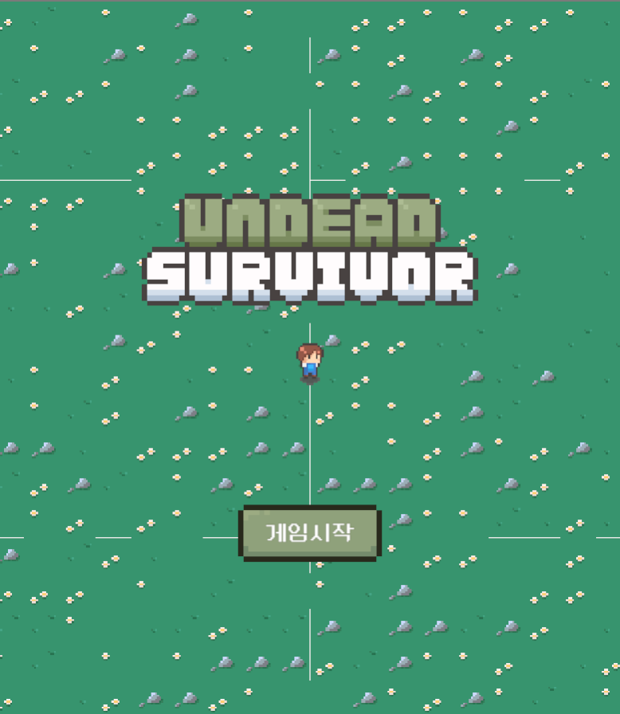

# Undead Servivor

Undead Survivor는 Unity 기반으로 개발한 탑다운 형식의 서바이벌 캐주얼 게임입니다.
플레이어는 몰려오는 언데드 무리 속에서 다양한 무기를 조합하고 강화하여 최대한 오래 생존하는 것을 목표로 합니다.

이 프로젝트는 Object Pooling, ScriptableObject 기반 데이터 구조화, 랜덤 스폰 알고리즘, UI 동기화, 무기 레벨 업 시스템 등 게임 개발의 핵심 시스템을 구현했습니다.
